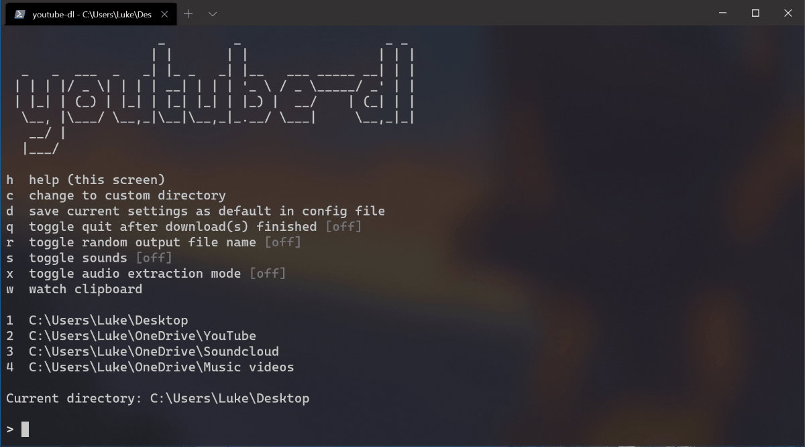
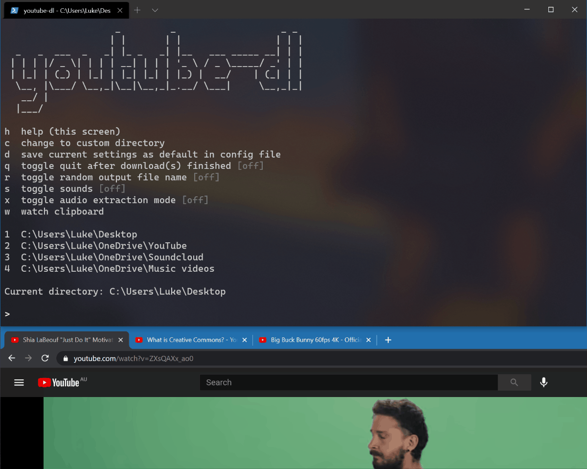

# youtube-dl.ps1
youtube-dl.ps1 is an interactive PowerShell wrapper script for [youtube-dl](https://github.com/ytdl-org/youtube-dl/). It was initially born of a desire to be able to easily switch between preset destination folders for youtube-dl, but has since increased in functionality somewhat.

## Getting started
As with many custom PowerShell scripts, you'll need to:

```
Set-ExecutionPolicy Unrestricted -Scope CurrentUser
```

The script can be launched via *Run with PowerShell* on its context menu, via a terminal or by a shortcut to this target (recommended):

```
powershell -NoProfile -ExecutionPolicy Bypass -File "C:\path\to\youtube-dl.ps1"
```

A *config.json* file with default settings will be generated alongside the script upon first run. If youtube-dl isn't found on your system, the script will offer to automatically download it for you.

**Note:** FFmpeg may be required for some operations, such as audio extraction. You'll need to [download that manually](https://ffmpeg.org/download.html) for the time being.

### Switching folders
Populate the `SaveLocations` array in *config.json* with preset destination folders you'd like to use, with the first one being your preferred default. Save the config file and re-run the script. You can now switch between folders using their corresponding numbers at the prompt. To start a download, just paste the URL and hit Enter.



### Watch clipboard mode
This example demonstrates "watch clipboard" mode, where the script will watch your clipboard for changes and attempt to start a download when a URL is found. Each youtube-dl process is launched concurrently. This is useful for starting many downloads at once. You can combine this mode with sounds (*s*) to hear audible feedback when downloads start and finish.



### Saving settings
To save your default settings (e.g. toggle states) to your config file, type *d*.